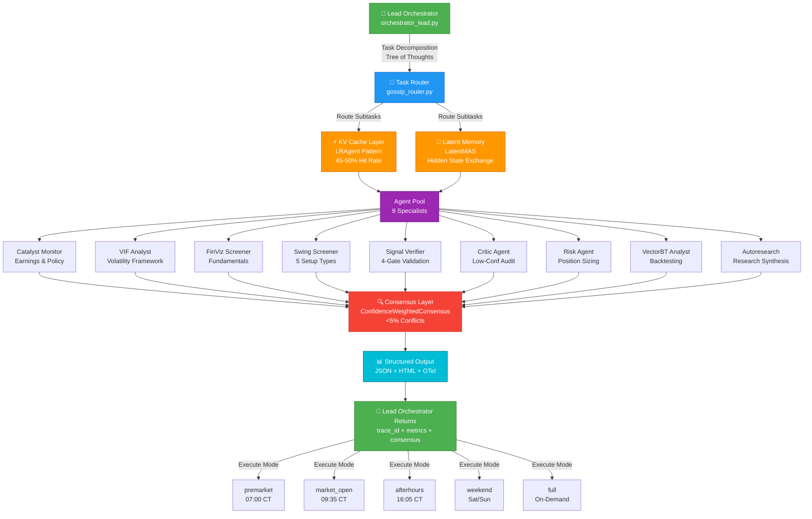

# VIF v4.0 Agentic Workflow Diagram



## Recovery State Machine (GitOps + Checkpointing)

```mermaid
stateDiagram-v2
    [*] --> DiagnosticPhase: Start Recovery
    
    DiagnosticPhase --> CheckGitConfig: Check repositoryformatversion
    CheckGitConfig --> GitMismatch{Format v0<br/>+ worktreeConfig?}
    
    GitMismatch -->|YES| FixGitFormat: Upgrade to v1
    GitMismatch -->|NO| CheckIDESettings
    
    FixGitFormat --> VerifyWorktrees: Test worktree list
    VerifyWorktrees --> CheckIDESettings
    
    CheckIDESettings --> CheckMCP: Check MCP servers
    CheckMCP --> CheckHooks: Check post-commit hook
    
    CheckHooks --> HookTest: Test hook manually
    HookTest --> HookWorks{Hook<br/>Functional?}
    
    HookWorks -->|YES| RecoveryComplete
    HookWorks -->|NO| FixHook: Enable bash execution
    FixHook --> RecoveryComplete
    
    RecoveryComplete --> Checkpoint: Save Recovery Checkpoint
    Checkpoint --> ValidateAgents: Validate agent pool
    ValidateAgents --> [*]: Ready for Production
    
    note right of DiagnosticPhase
        ReAct Loop: Observe → Diagnose → Act
    end note
    
    note right of RecoveryComplete
        Stateful Recovery: All fixes
        are non-destructive & reversible
    end note
```

## Cost Impact (Pre/Post Recovery)

```mermaid
xychart-beta
    title VIF v4.0 Cost Optimization (Post-Recovery)
    x-axis [Subprocess, Swarm v0, Swarm v1+]
    y-axis "Daily Cost ($)" 0 --> 0.15
    
    line [0.13, 0.10, 0.07]
    
    note: Cost reduction achieved via:
    - KV Cache Sharing (45-50% hit)
    - Latent State Collaboration
    - Gossip Routing Efficiency
    - Confidence-Weighted Consensus
```

---

## Workflow Execution Timeline

| Time (CT) | Mode | Agents Active | Output |
|-----------|------|---------------|--------|
| 07:00 | premarket | Catalyst + VIF + Swing | Breakfast briefing |
| 09:35 | market_open | Swing | Opening setup |
| 12:00 | (custom) | Any agent pool | Ad-hoc analysis |
| 16:05 | afterhours | VIF + Risk | Daily wrap |
| Sat/Sun | weekend | Catalyst + Autoresearch | Monday prep |

---

## Security & Observability

```
Every orchestrator execution generates:
┌─────────────────────────────────────┐
│ trace_id (unique session ID)        │
├─────────────────────────────────────┤
│ OTel spans (agent-level metrics)    │
├─────────────────────────────────────┤
│ Git commit (with trace_id + reason) │
├─────────────────────────────────────┤
│ logs/orchestrator_lead.log          │
├─────────────────────────────────────┤
│ logs/otel/*.jsonl (structured data) │
└─────────────────────────────────────┘

Full audit trail: reproducible & verifiable
```
